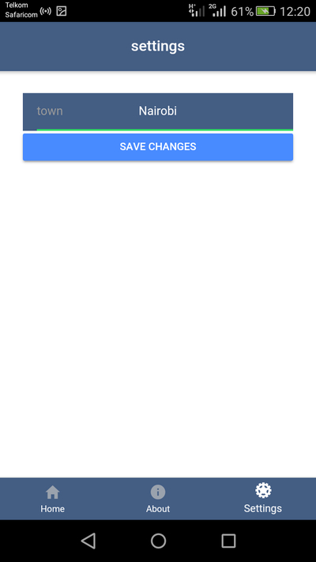
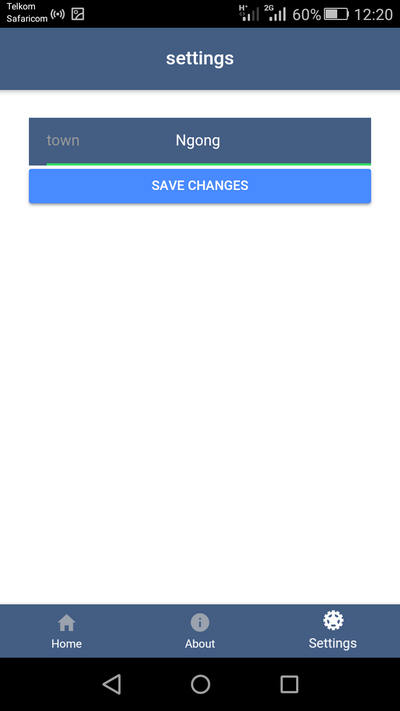

# Weatherman [](https://travis-ci.org/samwelkinuthia/weatherman)

[](http://forthebadge.com)

An Ionic web application that gives you weather conditions for any input town in kenya.


## How to use

The homepage displays default weather conditions for Nairobi. This includes the temprature, cloud conditions etc.

  

To find the conditions for another town, The user navigates to the settings page via clicking the settings icon.


At the settings page, A form is present for the town input. The field is already populated with the default value "Nairobi"



You can then add the town you want to view.



And on saving, You will be redirected to the homepage with the updated weather conditions.


## Make It Your Own

These instructions will get you a copy of the project up and running on your local machine for development and testing purposes.

### Prerequisites

Ensure you have the following installed in your machine.

* [Node Js](https://nodejs.org/en/)
* [Apache Cordova](https://cordova.apache.org/)
* [Ionic](https://ionicframework.com/)


### Installing

Once you have installed these do the following:

* Clone this repository by clicking the clone/download button.

* Navigate to the directory via your terminal. Something like ```cd /path/Weatherman/```

* Run ```npm install``` to install node dependencies.

* Navigate to the providers folder.

```
$ cd/Your_download_path/Weatherman/src/providers/weather
```
* Create an environment.ts file in this weather directory.
```
$ touch environment.ts
```

* Obtain an api key from [Underground Weather](https://www.wunderground.com/weather/api/) to make the api calls.

* Add the following to the environment.ts file
```
import { Injectable } from "@angular/core";

@Injectable()

export class EnvironmentProvider{
  key = 'INSERT YOUR API KEY HERE';
  constructor(){
  }
  provideKey(){
    return this.key
  }
}

```

* Now You are all set. Run **ionic serve**


* [https://localhost:8100](https://localhost:8100) will be automatically opened in your browser.


## Technologies Used

* Ionic framework
* Angular 4
* HTML
* SASS
* Underground Weather api

Happy Coding!

## Author

[Kinuthia Samwel](http://samwelkinuthia.github.io)


### Acknowledgment

@bradtraversy for initial youtube tutorial.
